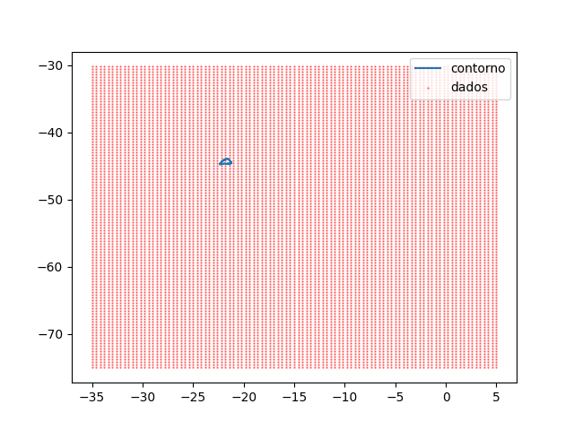
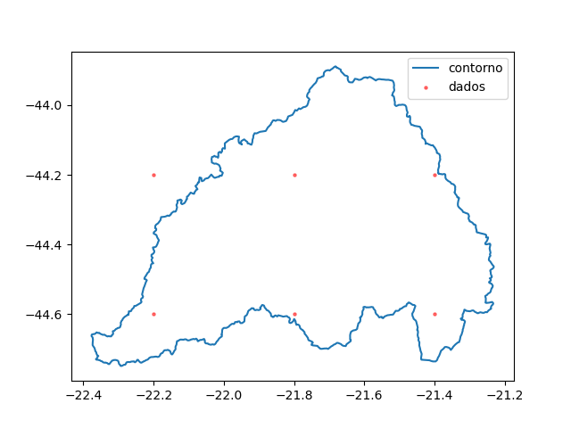

## Energy Challenge

### Desafio

O desafio proposto consiste em reponder à pergunta: "Qual é a previsão de precipitação acumulada dada pelo modelo ETA
no dia 01/12/2023 para a região de escoamento da usina Hidrelétrica Camargos (bacia do rio Grande)?".

A precipitação de uma região é dada pela média de todas as precipitações dentro de um contorno (representado por 
um polígono) e a precipitação acumulada para o dia $n$ é dada por $D_n = \sum\limits_{i=1}^n D_i$, onde $D_i$ representa a precipitação diária.

A resposta ao desafio deve ser apresentada graficamente.

### Algoritmo

Como os pontos de previsão de precipitação abarcam uma área maior que a região delimitada
pelo contorno da bacia do rio Grande, a solução para o desafio envolve encontrar, para cada dia,
os pontos de previsão que caem dentro do contorno.

O algoritmo para encontrar a precipitação média acumulada para todos os dias é o seguinte:

```text
function AccumulatedPrecipitationForRegion():
    forecasted_days := GetForecastedDaysList()
    contour := LoadContour()
    average_precipitation := []
    for day in forecasted_days; begin
        data_points := LoadDataPointsForDay(day)
        sum := 0
        count := 0
        list := []
        for point in data_points:
            if InsideContour(contour, point); begin
                sum := sum + point.data_value
                count := count + 1
            end
        end
        avg := sum / count
        Push(average_precipitation, avg)
    end
    return CumulativeSum(average_precipitation)
```

O algoritmo usado para a função `InsideContour` é o algoritmo de ray-casting (ref. https://www.eecs.umich.edu/courses/eecs380/HANDOUTS/PROJ2/InsidePoly.html).

```text
function InsideContour(contour, point):
    hits := 0
    i := contour.length()-1, j = 0
    while j < contour.length():
        if Hit(contour, i, j, point.lat, point.long):
            hits := hits + 1
        i := (i + 1) mod contour.length()
        j := i + 1

    is_inside_contour = (hits mod 2 != 0)
    return is_inside_contour

function Hit(contour, i, j, lat, long):
    condition_1 = (contour[i].long > long) != (contour[j].long > long)
    condition_2 = lat < ((contour[j].lat - contour[i].lat) * (long - contour[i].long) / (contour[j].long - contour[i].long) + contour[i].lat)
    if condition_1 and condition_2:
        return 1
    return 0
```

### Implementação

A implementação é agnóstica a qualquer informação sobre datas e dados e não presume nenhuma informação adicional sobre o arquivo (não presume que se sabe
de antemão onde estão localizados, no arquivo, os pontos que caem dentro do contorno) e também não presume que os
arquivos são idênticos (não presume que a solução para um arquivo é exatamente a mesma que para outros arquivos).

Inicialmente a implementação envolveu apenas a tradução literal do algoritmo acima. 
Entretanto, apenas usar o algoritmo acima não foi suficiente para carregar todos os dados de maneira eficiente,
o programa demora para terminar. 

Para otimizar o programa, o primeiro passo tomado foi entender os dados. Para isso, plotei todos os pontos de dados
juntamente com o contorno:



Notei que a maior parte dos pontos observados caem fora do contorno. 
Portanto, para acelerar a execução do programa, a melhor forma é ignorar os pontos
que caem muito longe do contorno. A forma que isso é realizado é obtendo os limites do contorno (as latitudes e longitudes
máximas e mínimas -- função `contour_limits`) e filtrando todos os pontos que não caem dentro 
do conjunto de dados que não caem no retângulo delimitado pelos limites (função `filter_data`).

```python
def contour_limits(contour_df: pd.DataFrame) -> tuple[float, float, float, float]:
    return (
        contour_df['lat'].max(),
        contour_df['lat'].min(),
        contour_df['long'].max(),
        contour_df['long'].min(),
    )


def filter_data(contour_df: pd.DataFrame, data_df: pd.DataFrame) -> pd.DataFrame:
    max_lat, min_lat, max_long, min_long = contour_limits(contour_df)
    return data_df[(min_lat <= data_df['lat']) & (data_df['lat'] <= max_lat) &
                   (min_long <= data_df['long']) & (data_df['long'] <= max_long)]

```

Com isso, o conjunto de dados é reduzido a alguns poucos pontos.



Além disso, é possível acelerar operações com o dataframe usando o kernel do `pandas`, e a função que verifica se os pontos estão dentro do contorno é 
implementada com `pandas.apply` + `inside_contour` + `hit`, dentro da função `apply_contour`.

```python
def hit(p1, p2, lat, long) -> int:
    safe_div = float("inf")
    if diff := p2['long'] - p1['long']:
        safe_div = diff
    if (
            ((p1['long'] > long) != (p2['long'] > long)) and
            (lat < ((p2['lat'] - p1['lat']) * (long - p1['long']) / safe_div + p1['lat']))
    ):
        return 1
    return 0


def inside_contour(contour_df, lat: float, long: float) -> bool:
    zip_range = zip(range(len(contour_df)-1), range(1, len(contour_df)))
    hits: int = sum((hit(contour_df.iloc[i], contour_df.iloc[j], lat, long) for i, j in zip_range))
    return (hits & 1) == 1


def apply_contour(contour_df: pd.DataFrame, data_df: pd.DataFrame) -> pd.DataFrame:

    contour_df = pd.concat([contour_df, contour_df.iloc[[0]]], ignore_index=True)
    points_inside_contour_df: pd.DataFrame = data_df[
        data_df.apply(
            lambda row: inside_contour(contour_df, row['lat'], row['long']), axis=1
        )
    ]
    return points_inside_contour_df
```

O programa é executado em ~3s, mas pode ser melhorado.

Usando o kernel do `numpy`, é possível implementar funções vetorizadas `apply_contourv` e `hitv`.

```python
def hitv(contour_df, data_df):
    lats = data_df['lat'].to_numpy(np.float64).reshape(1, -1)
    longs = data_df['long'].to_numpy(np.float64).reshape(1, -1)

    df_1_lats = contour_df.iloc[:-1, 0].to_numpy(np.float64).reshape(-1, 1)
    df_1_longs = contour_df.iloc[:-1, 1].to_numpy(np.float64).reshape(-1, 1)
    df_2_lats = contour_df.iloc[1:, 0].to_numpy(np.float64).reshape(-1, 1)
    df_2_longs = contour_df.iloc[1:, 1].to_numpy(np.float64).reshape(-1, 1)

    safe_div = np.where(df_2_longs - df_1_longs != 0, df_2_longs - df_1_longs, np.inf)

    cond_1_1 = df_1_longs > longs
    cond_1_2 = df_2_longs > longs
    cond_1 = cond_1_1 != cond_1_2
    op = (longs - df_1_longs) * (df_2_lats - df_1_lats) / safe_div + df_1_lats
    cond_2 = lats < op
    cond = cond_1 & cond_2
    hits = np.sum(cond, axis=0)

    return ((hits & 1) == 1).astype(bool)


def apply_contourv(contour_df: pd.DataFrame, data_df: pd.DataFrame) -> pd.DataFrame:
    data_df = filter_data(contour_df, data_df)
    contour_df = pd.concat([contour_df, contour_df.iloc[[0]]], ignore_index=True)
    mask = hitv(contour_df, data_df)
    masked_data = data_df.iloc[mask, :]
    return masked_data
```

Por fim, o código passa a executar em ~1s.

### Solução

A solução para a pergunta é apresentada abaixo. O gráfico busca mostrar
a precipitação média diária, permitindo a comparação entre valores diários, e a precipitação média
acumulada com um gráfico de linha.


```text
  forecast_date forecasted_date  data_value  data_value_acc
0      01-12-21        02-12-21        2.16            2.16
1      01-12-21        03-12-21        9.04           11.20
2      01-12-21        04-12-21        1.44           12.64
3      01-12-21        05-12-21        7.64           20.28
4      01-12-21        06-12-21       16.08           36.36
5      01-12-21        07-12-21        2.38           38.74
6      01-12-21        08-12-21       19.04           57.78
7      01-12-21        09-12-21       19.06           76.84
8      01-12-21        10-12-21       43.68          120.52
9      01-12-21        11-12-21        1.12          121.64
```


